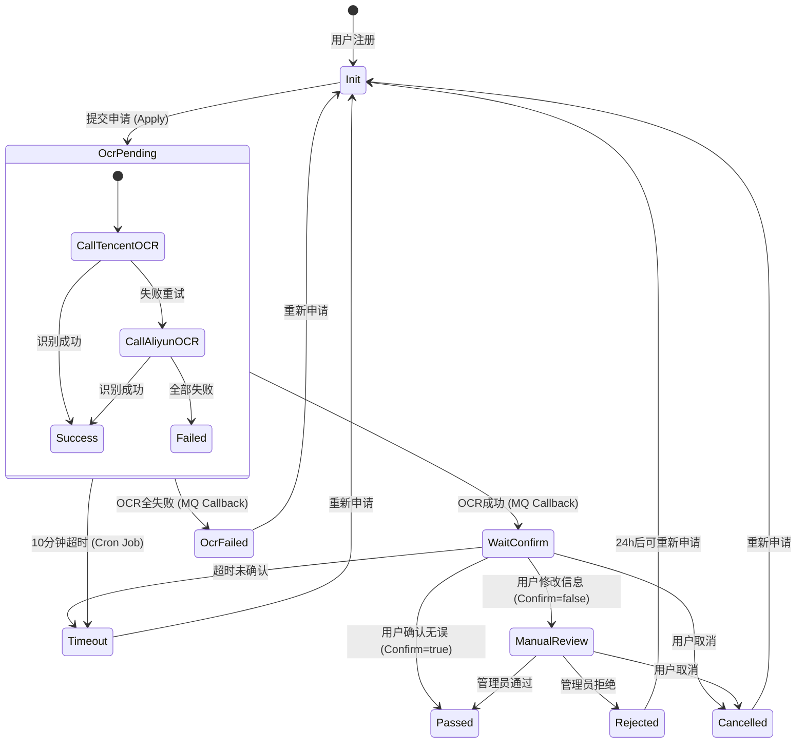

# 学生认证模块详细设计方案 (Student Verification Design)

## 1. 概述 (Overview)

本模块旨在为 CampusHub 提供可信的学生身份认证服务，确保平台用户（特别是活动发布者）具备真实的学生身份。

### 1.1 核心价值
- **身份核验**: 通过 OCR 技术自动识别学生证信息，辅以人工审核，确保身份真实性。
- **权益关联**: 认证通过后获得 "Student Verified" 标识，解锁发布活动等高阶权限。
- **自动化流程**: 引入 OCR 和自动状态流转，减少人工审核成本。

---

## 2. 业务流程与状态机 (Workflow & State Machine)

### 2.1 状态定义
状态常量定义在 `common/constants/verify.go` 中。

| 状态码 | 状态名 | 英文标识 | 描述 |
| :--- | :--- | :--- | :--- |
| 0 | 初始 | Init | 未申请或可重新申请 |
| 1 | OCR审核中 | OcrPending | 已提交图片，等待 OCR 识别结果 |
| 2 | 待用户确认 | WaitConfirm | OCR 成功，等待用户确认识别信息 |
| 3 | 人工审核中 | ManualReview | 用户修改了识别信息，转入人工复核 |
| 4 | 已通过 | Passed | 认证成功（终态） |
| 5 | 已拒绝 | Rejected | 人工审核拒绝（终态，有冷却期） |
| 6 | 已超时 | Timeout | 10分钟未完成 OCR 或未确认 |
| 7 | 已取消 | Cancelled | 用户主动取消 |
| 8 | OCR失败 | OcrFailed | 双 OCR 引擎均识别失败 |

### 2.2 状态流转图



---

## 3. 接口设计 (Interface Design)

### 3.1 User API (HTTP)
对外暴露的接口，供前端/App调用。

| 方法 | 路径 | 说明 |
| :--- | :--- | :--- |
| GET | `/api/v1/verify/student/current` | 获取当前认证状态及进度 |
| POST | `/api/v1/verify/student/apply` | 提交认证申请（上传图片URL） |
| POST | `/api/v1/verify/student/confirm` | 确认或修改 OCR 识别结果 |
| POST | `/api/v1/verify/student/cancel` | 取消认证申请 |

### 3.2 User RPC (gRPC)
内部微服务调用接口。

| 方法 | 调用方 | 说明 |
| :--- | :--- | :--- |
| `IsVerified` | Activity Service | 查询用户是否已认证（报名/发布鉴权） |
| `UpdateVerifyStatus` | MQ Consumer / Cron | 更新认证状态（系统内部流转） |
| `GetVerifyInfo` | User API | 获取已认证用户的详细信息 |

---

## 4. 关键技术实现 (Technical Implementation)

### 4.1 异步 OCR 处理 (MQ)
为了避免 HTTP 请求超时并提高吞吐量，OCR 识别采用异步处理。

*   **消息队列**: Kafka / RabbitMQ (根据基础设施选型)
*   **Topic**: `user-verify-ocr`
*   **Producer**: `ApplyStudentVerify` 接口成功创建记录后发送消息。
*   **Consumer**: `User MQ` 服务监听该 Topic，调用 OCR SDK。
*   **Payload 定义**:
    ```json
    {
      "verify_id": 1001,
      "user_id": 12345,
      "front_image_url": "https://oss.../front.jpg",
      "back_image_url": "https://oss.../back.jpg",
      "timestamp": 1700000000
    }
    ```

### 4.2 双 OCR 引擎策略 (Strategy Pattern)
*   **首选**: 腾讯云 OCR (Tencent Cloud OCR) - 针对国内证件优化较好。
*   **备选**: 阿里云 OCR (Aliyun OCR) - 当腾讯云调用失败或返回无法识别时触发。
*   **实现**: 工厂模式 + 策略模式 (`app/user/rpc/internal/ocr`)。

### 4.3 定时超时处理 (Cron Job)
防止申请流程僵死（如 OCR 服务挂了，或用户传完图就跑了）。
*   **任务**: `VerifyTimeoutJob`
*   **频率**: 每分钟执行一次
*   **逻辑**: 
    1. 扫描 `status = 1 (OcrPending)` 且 `created_at < now - 10min` 的记录 -> 更新为 `Timeout`。
    2. (可选) 扫描 `status = 2 (WaitConfirm)` 且 `ocr_completed_at < now - 30min` 的记录 -> 更新为 `Timeout`。

---

## 5. 数据模型 (Database Schema)

表名: `student_verifications`

```sql
CREATE TABLE `student_verifications` (
  `id` bigint(20) NOT NULL AUTO_INCREMENT,
  `user_id` bigint(20) NOT NULL COMMENT '用户ID',
  `status` tinyint(4) NOT NULL DEFAULT '0' COMMENT '状态:0初始,1OCR中,2待确认,3人工审核,4通过,5拒绝,6超时,7取消,8OCR失败',
  `real_name` varchar(100) DEFAULT '' COMMENT '真实姓名',
  `school_name` varchar(100) DEFAULT '' COMMENT '学校名称',
  `student_id` varchar(100) DEFAULT '' COMMENT '学号',
  `department` varchar(100) DEFAULT '' COMMENT '院系',
  `admission_year` varchar(10) DEFAULT '' COMMENT '入学年份',
  `front_image_url` varchar(500) DEFAULT '' COMMENT '正面图',
  `back_image_url` varchar(500) DEFAULT '' COMMENT '背面图',
  `ocr_platform` varchar(20) DEFAULT '' COMMENT 'OCR平台:tencent/aliyun',
  `ocr_confidence` decimal(5,2) DEFAULT NULL COMMENT '置信度',
  `ocr_raw_json` text COMMENT 'OCR原始JSON',
  `reject_reason` varchar(255) DEFAULT '' COMMENT '拒绝原因',
  `operator` varchar(50) DEFAULT '' COMMENT '操作人/系统',
  `verified_at` datetime DEFAULT NULL COMMENT '通过时间',
  `created_at` datetime NOT NULL DEFAULT CURRENT_TIMESTAMP,
  `updated_at` datetime NOT NULL DEFAULT CURRENT_TIMESTAMP ON UPDATE CURRENT_TIMESTAMP,
  PRIMARY KEY (`id`),
  UNIQUE KEY `uk_user_id` (`user_id`),
  KEY `idx_status_created` (`status`, `created_at`)
) ENGINE=InnoDB DEFAULT CHARSET=utf8mb4 COMMENT='学生认证表';
```

---

## 6. 待完善项 (Pending Items)

1.  **MQ 消息定义**: 需要在 `app/user/mq` 中明确定义 `user-verify-ocr` 的消费者逻辑。
2.  **OCR 配置**: 需在 `user-rpc.yaml` 中添加腾讯云/阿里云的 AK/SK 配置。
3.  **Cron 任务**: 需要在 `app/user/rpc` 或独立 Cron 服务中注册超时扫描任务。
4.  **管理后台接口**: 目前仅设计了 C 端接口，还需补充管理员审核列表和审核操作接口 (Admin API)。
