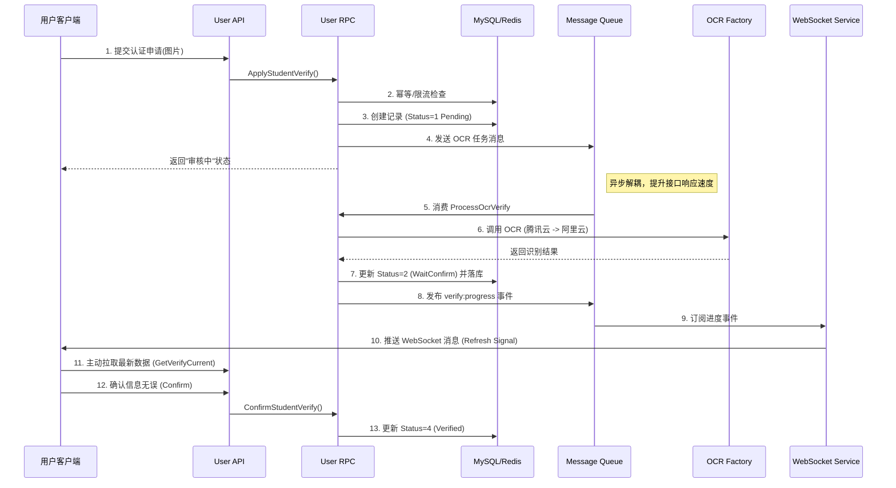

# Go-Zero微服务实战：高并发场景下的学生认证系统设计与实现

> **摘要**：在校园社交、招聘等垂直领域应用中，"学生身份认证"是构建信任体系的核心基石。本文基于 Go-Zero 微服务框架，详细拆解了一个生产级的学生认证系统实现。涵盖了 **OCR 双通道故障转移**、**WebSocket 实时推送**、**事件驱动架构 (EDA)**、**敏感数据加密** 以及 **有限状态机（FSM）** 的设计模式。对于准备中高级 Golang 面试的同学，这是一个展示业务架构能力的绝佳案例。

---

## 1. 业务背景与挑战

在 CampusHub 项目中，我们需要确保用户是真实的在校大学生。传统的"上传图片 -> 后台人工审核"模式存在以下痛点：
1.  **时效性差**：用户上传后需等待数小时甚至数天。
2.  **人力成本高**：随着用户量增长，审核团队压力巨大。
3.  **数据安全**：学生证包含姓名、学号等敏感信息，明文存储存在合规风险。

**解决方案**：引入 OCR（光学字符识别）技术，配合"机器预审 + 人工抽检/修正"的混合模式，实现秒级认证体验。

---

## 2. 系统架构设计

我们采用 **Go-Zero 微服务分层架构**，将系统严格拆分为 API 层（接入网关）、RPC 层（业务逻辑）和 Model 层（数据持久化），实现了清晰的 **关注点分离 (Separation of Concerns)**。

### 2.1 核心流程图

![学生认证流程图](https://mermaid.ink/img/CnNlcXVlbmNlRGlhZ3JhbQogICAgcGFydGljaXBhbnQgVXNlciBhcyDnlKjmiLflrqLmiLfnq68KICAgIHBhcnRpY2lwYW50IEFQSSBhcyBVc2VyIEFQSQogICAgcGFydGljaXBhbnQgUlBDIGFzIFVzZXIgUlBDCiAgICBwYXJ0aWNpcGFudCBEQiBhcyBNeVNRTC9SZWRpcwogICAgcGFydGljaXBhbnQgTVEgYXMgTWVzc2FnZSBRdWV1ZQogICAgcGFydGljaXBhbnQgT0NSIGFzIE9DUiBGYWN0b3J5CiAgICBwYXJ0aWNpcGFudCBXUyBhcyBXZWJTb2NrZXQgU2VydmljZQoKICAgIFVzZXItPj5BUEk6IDEuIOaPkOS6pOiupOivgeeUs+ivtyjlm77niYcpCiAgICBBUEktPj5SUEM6IEFwcGx5U3R1ZGVudFZlcmlmeSgpCiAgICBSUEMtPj5EQjogMi4g5bmC562JL+mZkOa1geajgOafpQogICAgUlBDLT4+REI6IDMuIOWIm+W7uuiusOW9lSAoU3RhdHVzPTEgUGVuZGluZykKICAgIFJQQy0+Pk1ROiA0LiDlj5HpgIEgT0NSIOS7u+WKoea2iOaBrwogICAgUlBDLS0+PlVzZXI6IOi/lOWbniLlrqHmoLjkuK0i54q25oCBCgogICAgTm90ZSByaWdodCBvZiBNUTog5byC5q2l6Kej6ICm77yM5o+Q5Y2H5o6l5Y+j5ZON5bqU6YCf5bqmCgogICAgTVEtPj5SUEM6IDUuIOa2iOi0uSBQcm9jZXNzT2NyVmVyaWZ5CiAgICBSUEMtPj5PQ1I6IDYuIOiwg+eUqCBPQ1IgKOiFvuiur+S6kSAtPiDpmL/ph4zkupEpCiAgICBPQ1ItLT4+UlBDOiDov5Tlm57or4bliKvnu5PmnpwKICAgIFJQQy0+PkRCOiA3LiDmm7TmlrAgU3RhdHVzPTIgKFdhaXRDb25maXJtKSDlubbokL3lupMKICAgIFJQQy0+Pk1ROiA4LiDlj5HluIMgdmVyaWZ5OnByb2dyZXNzIOS6i+S7tgogICAgCiAgICBNUS0+PldTOiA5LiDorqLpmIXov5vluqbkuovku7YKICAgIFdTLT4+VXNlcjogMTAuIOaOqOmAgSBXZWJTb2NrZXQg5raI5oGvIChSZWZyZXNoIFNpZ25hbCkKICAgIFVzZXItPj5BUEk6IDExLiDkuLvliqjmi4nlj5bmnIDmlrDmlbDmja4gKEdldFZlcmlmeUN1cnJlbnQpCiAgICBVc2VyLT4+QVBJOiAxMi4g56Gu6K6k5L+h5oGv5peg6K+vIChDb25maXJtKQogICAgQVBJLT4+UlBDOiBDb25maXJtU3R1ZGVudFZlcmlmeSgpCiAgICBSUEMtPj5EQjogMTMuIOabtOaWsCBTdGF0dXM9NCAoVmVyaWZpZWQpCg==)

> *注：上图由 Mermaid 自动生成，若无法查看请访问 [Mermaid Live Editor](https://mermaid.live/) 粘贴源码生成。*

<details>
<summary>点击查看 Mermaid 源码</summary>


</details>

### 2.2 状态机设计 (State Machine)

认证流程复杂，必须通过严格的状态机管理，防止状态回退或跳跃。我们在 `model` 层定义了如下状态：

| 状态码 | 常量名 | 含义 | 允许流转至 |
| :--- | :--- | :--- | :--- |
| `0` | `Initial` | 初始 | `1` |
| `1` | `OcrPending` | OCR处理中 | `2` (成功), `8` (失败), `6` (超时) |
| `2` | `WaitConfirm` | 待用户确认 | `4` (通过), `3` (人工审核) |
| `3` | `ManualReview`| 人工审核中 | `4` (通过), `5` (拒绝) |
| `4` | `Verified` | 已通过 | - |
| `8` | `OcrFailed` | OCR失败 | `3` (转人工) |

---

## 3. 核心技术实现

### 3.1 敏感数据安全 (AES Encryption)

用户的真实姓名和学号属于 PII (个人敏感信息)，严禁明文存储。我们在 Model 层实现了透明加密：

```go
// app/user/model/student_verification.go

type StudentVerification struct {
    // 真实姓名（AES加密存储，查询时自动解密）
    RealName string `gorm:"column:real_name;size:100" json:"real_name"`
    // 学号（AES加密 + 唯一索引）
    StudentID string `gorm:"uniqueIndex:uk_school_student;column:student_id" json:"student_id"`
    // ... 其他字段
}
```

> **加密的意图** 加密不代表不会泄露，而是为了避免风险扩散。所以加密不是为了‘让业务看不到’，而是为了在某些失守场景里把损失压小。
> **未来拓展点**：如果加密了，如何做"学号唯一性校验"？
> **设计**：使用确定性加密算法（Deterministic Encryption）或保留哈希列（Hash Column）用于索引查找，而密文用于解密展示。本项目采用了加密后的密文直接建立唯一索引。

### 3.2 高可用 OCR 设计：双通道故障转移

OCR 服务依赖第三方云厂商（腾讯云/阿里云），存在网络抖动或服务宕机的风险。为了保证核心业务的高可用性，我们设计了 **Provider Factory（提供商工厂）** 模式，实现了自动故障转移和熔断。

**核心逻辑 (Factory Pattern + Circuit Breaker)**：

1.  **主备策略**：默认使用腾讯云（ExtractDocBasic），若失败则降级到阿里云（RecognizeGeneralStructure）。
2.  **熔断机制**：使用 Redis 记录失败次数。若某提供商在 5 分钟内连续失败 3 次，则触发熔断（Open State），5 分钟内不再调用，直接切换备用通道。

```go
// app/user/ocr/factory.go

func (f *ProviderFactory) Recognize(ctx context.Context, frontURL, backURL string) (*OcrResult, error) {
    // 1. 尝试主提供商 (腾讯云)
    if f.primary != nil {
        result, err := f.tryProvider(ctx, f.primary, frontURL, backURL)
        if err == nil { return result, nil }
        logx.Errorf("主OCR失败: %v", err)
    }

    // 2. 主通道失败或熔断，尝试备用提供商 (阿里云)
    if f.fallback != nil {
        result, err := f.tryProvider(ctx, f.fallback, frontURL, backURL)
        if err == nil { return result, nil }
        logx.Errorf("备用OCR失败: %v", err)
    }

    // 3. 全军覆没
    return nil, errorx.ErrOcrServiceUnavailable()
}
```
> **其他意图** 我当初敲定设计方案时，其实也有薅羊毛的想法。因为腾讯云与阿里云都送有免费额度。当”腾讯云”的额度用完时，我还可以通过”双通道转移“继续薅阿里云的羊毛。

### 3.3 事件驱动架构与解耦 (Event-Driven Architecture)

在微服务架构中，**解耦**是提升系统可扩展性的关键。本项目基于 **Watermill** 框架和 **Redis Streams** 构建了轻量级的事件总线 (Event Bus)，将业务逻辑拆分为"核心链路"和"辅助链路"。

**核心设计**：

1.  **业务事件 (verify:events)**：
    *   **发布者**：`ApplyStudentVerify` 接口。
    *   **消费者**：OCR 处理 Worker (基于 Consumer Group)。
    *   **目的**：**削峰填谷**。OCR 识别是耗时操作（1-3秒），如果同步处理会阻塞 API 线程。通过 Redis Streams 异步化，API 接口可以达到毫秒级响应，同时保护下游 OCR 服务不被突发流量打垮。

2.  **通知事件 (verify:progress)**：
    *   **发布者**：OCR Worker (当识别完成时)。
    *   **消费者**：WebSocket 服务。
    *   **目的**：**逻辑解耦**。认证服务（Verify Service）只需要关注"状态变更"，而不需要关心"如何通知用户"。

```go
// app/user/rpc/internal/logic/verifyservice/apply_student_verify_logic.go

// 发布认证申请事件（业务链路）
// 消息流向：RPC -> Redis Stream -> OCR Worker
eventData := messaging.VerifyApplyEventData{
    VerifyID: verifyID,
    UserID:   in.UserId,
    // ...
}
l.svcCtx.MsgClient.Publish(l.ctx, messaging.TopicVerifyEvent, eventData)
```

### 3.4 实时进度推送：WebSocket 推拉结合

OCR 识别是异步过程，为了让前端能"即时"感知结果，我们没有使用传统的轮询（Polling），而是采用了 **WebSocket 推拉结合（Push-Pull）** 模式。

1.  **服务端 Push 信号**：当 OCR 完成或状态变更时，RPC 服务通过 Redis Streams 发布 `verify:progress` 事件。
2.  **网关层 Forward**：WebSocket 服务订阅该 Topic，找到对应的在线用户连接，推送一条轻量级指令 `{ "type": "verify_progress", "refresh": true }`。
3.  **客户端 Pull 数据**：前端收到信号后，调用 `GET /current` 接口拉取最新的认证数据。

**为什么不直接 Push 数据？**
> **面试加分项**：直接 Push 完整数据（如包含大量 OCR 字段的大 JSON）会占用 WebSocket 带宽，且容易导致前后端数据结构版本不一致。Push 信号 + Pull 数据实现了**控制流与数据流分离**，既保证了实时性，又复用了现有的 HTTP API 逻辑，降低了系统复杂度。

```go
// app/user/rpc/internal/logic/verifyservice/verify_progress_push_helper.go

func publishVerifyProgress(ctx context.Context, svcCtx *svc.ServiceContext, userID int64, ...) {
    event := messaging.VerifyProgressEventData{
        UserID:    userID,
        Status:    int32(status),
        Refresh:   true, // 告知前端需要刷新
        Timestamp: time.Now().Unix(),
    }
    // 发布到 Redis Channel，由 WebSocket 服务消费
    svcCtx.MsgClient.Publish(ctx, messaging.TopicVerifyProgress, event)
}
```

### 3.5 异步 OCR 处理与并发防护

在 `app/user/rpc/internal/logic/verifyservice/process_ocr_verify_logic.go` 中，我们处理了几个关键问题：

1.  **竞态条件 (Race Condition)**：用户在 OCR 识别期间可能取消申请，或者任务超时。
2.  **Double Check**：在更新数据库前，再次检查当前状态。

```go
// ProcessOcrVerify 处理 OCR 识别（供统一 MQ Consumer 调用）
func (l *ProcessOcrVerifyLogic) ProcessOcrVerify(in *pb.ProcessOcrVerifyReq) (*pb.ProcessOcrVerifyResp, error) {
    // ... 省略前置检查 ...

    // 3. 调用 OCR (带30s超时控制)
    ocrResult, err := l.svcCtx.OcrFactory.Recognize(ocrCtx, in.FrontImageUrl, in.BackImageUrl)

    // 4. 后置状态检查 (Critical Section)
    // 再次检查状态，防止 OCR 执行期间用户执行了"取消"操作
    if l.isStatusChanged(in.VerifyId) {
        return &pb.ProcessOcrVerifyResp{Message: "OCR期间状态已变更，丢弃结果"}, nil
    }

    // 5. 更新结果并触发 WebSocket 推送
    if err == nil {
        l.svcCtx.StudentVerificationModel.UpdateOcrResult(..., ocrResult)
        publishVerifyProgress(..., constants.VerifyStatusWaitConfirm)
    }
}
```

---

## 4. 设计思路/精华

**Q1: 我们为什么不直接在 API 接口中同步调用 OCR？**
**A**: OCR 识别通常耗时 1-3 秒，受网络和第三方服务波动影响大。如果同步调用，会阻塞 HTTP 连接，导致 API 吞吐量（QPS）剧降。使用 MQ 异步解耦，可以让 API 瞬间响应，提升系统稳定性。

**Q2: 如果 OCR 识别错了怎么办？**
**A**: 我们设计了 `WaitConfirm`（待确认）状态。OCR 只是辅助输入，最终数据必须由用户确认。如果用户修改了 OCR 识别出的姓名或学号，系统会自动将状态流转至 `ManualReview`（人工审核），由管理员在后台介入。

**Q3: 如何保证 OCR 服务的高可用？**
**A**: 我们实现了 `ProviderFactory` 模式。配置了腾讯云为主通道，阿里云为备用通道。配合 Redis 实现的熔断器，当主通道连续失败 3 次时，系统会自动切换到备用通道，确保业务不中断。

---

## 5. 总结

本模块展示了如何利用 Go-Zero 构建一个健壮的业务系统。从 **Go-Zero 分层架构** 的清晰职责划分，到 **事件驱动架构 (EDA)** 的解耦，再到 **双通道故障转移** 和 **WebSocket 实时推送** 的细节打磨，完美体现了高内聚、低耦合的设计思想。

---
*本文基于 CampusHub 开源项目实战代码编写。*
